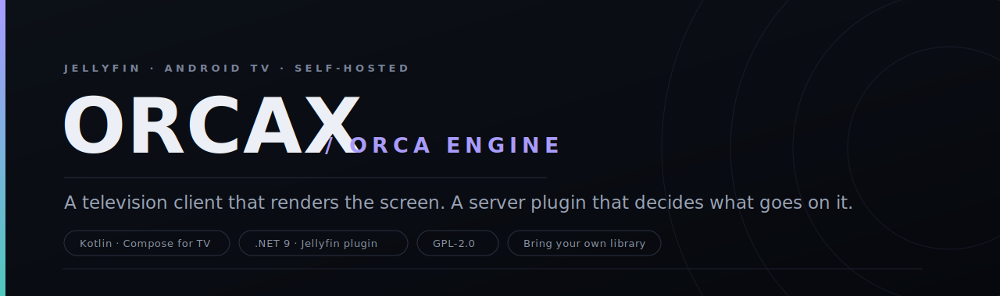
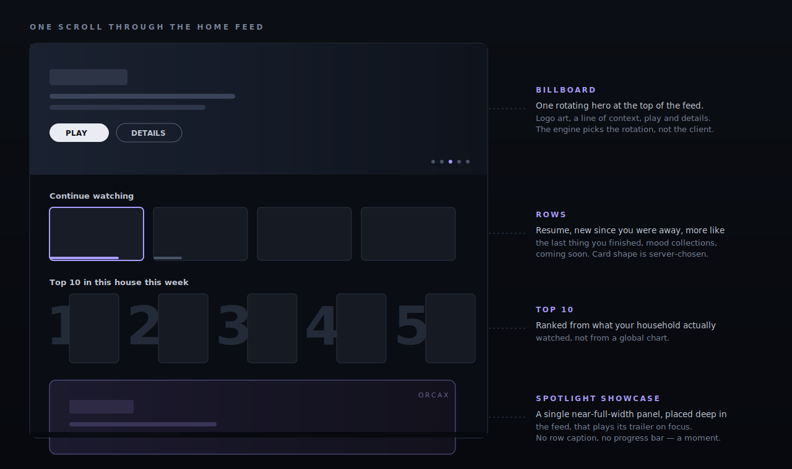
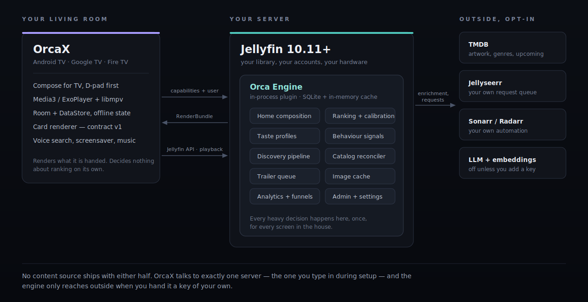

<!-- OrcaX -->

<p align="center">
  
</p>

<p align="center">
  <a href="#build"></a>
  <a href="#build"></a>
  <a href="#the-orca-engine"></a>
  <a href="LICENSE"></a>
</p>

OrcaX is a television client for [Jellyfin](https://jellyfin.org). It runs on Android TV, Google TV, and Fire TV, and it is built for the ten-foot experience from the ground up: a D-pad, a big panel across the room, and nothing else in your hands.

It has a companion. Most TV clients try to be clever on the device — sorting rows, guessing what you want, juggling artwork — while a phone in the next room does the same work twice. OrcaX splits the job in half. The app renders the screen. A server-side plugin, the **[Orca Engine](#the-orca-engine)**, decides what belongs on it. Turn a television on anywhere in the house and the same brain has already done the thinking.

You can run OrcaX against a plain Jellyfin server and it behaves like a polished, fast, focus-first client. Add the engine and the home screen stops being a list of folders and starts being a room that knows the household.

---

## First, the part that matters

OrcaX is a **client**. It ships with no library, no catalog, and no content of any kind. It does not scrape, index, or reach out to anywhere on its own. During setup you type in the address of exactly one server — yours — and from that point on it talks only to that server and the accounts you sign in with.

Jellyfin is a media server for organizing and streaming a collection you already own or otherwise have the right to play. OrcaX is a nicer way to sit on the couch and watch that collection. The request features route to *your* [Jellyseerr](https://github.com/Fallenbagel/jellyseerr) and *your* Sonarr/Radarr — the tools you already use to manage your own library — and only when you ask them to. Trailers and artwork come from public metadata sources such as [TMDB](https://www.themoviedb.org/).

There is no piracy story here because there is nothing to pirate with. This project does not help anyone obtain media they are not entitled to, and it never will. What you point it at is your responsibility; what it does with that is draw it beautifully.

---

## What it looks like on screen

<p align="center">
  
</p>

The home feed is composed, not concatenated. Instead of stacking whatever libraries exist in whatever order, the screen is assembled from a handful of deliberate surfaces:

- **Billboard.** One rotating hero at the very top — logo artwork, a line of context, play and details. The rotation is chosen upstream, so it reflects the household rather than the last thing that happened to sync.
- **Rows.** Continue watching, new since you were last around, more like the thing you just finished, mood collections, coming soon. Each row's card shape (poster, wide banner, person circle, episode still) is decided per-row rather than hardcoded, so a "directors" row can look nothing like a "keep watching" row.
- **Top 10.** Ranked from what your own house watched this week, drawn with the oversized numerals the format is known for. Not a global chart — your chart.
- **Spotlight showcase.** A single near-full-width panel dropped *deep* in the feed, not stacked under the billboard. It has no row caption and no progress bar, and it plays its trailer inline when you land on it. It is meant to feel like a moment, not a shelf.

Every one of those is described to the app by the engine as a render contract; the app's job is to turn that description into focusable, remote-friendly Compose UI and get out of the way.

---

## Features

**Playback that respects the panel.** OrcaX plays through Media3/ExoPlayer, with an optional native [libmpv](https://github.com/mpv-player/mpv) path for the formats ExoPlayer would rather not touch. The quality picker has an AUTO mode that measures the link once, picks a tier, and then *stays put* — it rescues you one way if a stream genuinely starves, but it will not sit there oscillating up and down through a movie. It knows the difference between your server being on the LAN and your server being across the internet, it does not mistake the last fifteen seconds of a film for a network problem, and it will not stream-copy an audio track your TV cannot decode and leave you with silent video.

**Trailers, done quietly.** Cards can carry an inline trailer that begins on focus, with a preferred audio language and a start offset so it opens on the good part. A small pool of players is recycled so the feed never spins up more decoders than it needs.

**Requests, in place.** When the engine surfaces something that is not in the library yet, the card wears a badge that tells the truth about where it is — requestable, requested, downloading, freshly added, or ready to play — and the request goes to your own queue. Nothing downloads by itself.

**The rest of a real client.** Voice search, a proper details experience for movies and series with people and extras, music and playlists, a screensaver / daydream mode, subtitle download and styling, per-user quality preferences that survive a restart, and multi-user switching. Content advisories, when enabled on the engine, appear as a spoiler-free overlay you can dismiss.

**Three shapes for three stores.** Build flavors for `default` (sideload/self-update), `appstore` (leanback, no self-updater), and `firetv`.

---

## The Orca Engine

<p align="center">
  
</p>

The engine is a Jellyfin plugin (.NET 9, Jellyfin 10.11+) that runs *inside* your server. It is the half of this project that thinks. It builds the home feed, ranks recommendations, keeps taste profiles, folds in behaviour signals, reconciles what is available against what is requestable, warms trailers, and exposes a small admin surface — all once, on the server, for every screen in the house.

It lives in its own repository with its own README and its own [availability model](.github/assets/availability.svg). The short version of the division of labour:

| OrcaX (this repo) | Orca Engine (server plugin) |
| --- | --- |
| Renders cards, rows, and heroes | Composes which cards, rows, and heroes |
| Plays media, manages focus and input | Ranks, personalizes, and calibrates |
| Advertises what it can draw (contract v1) | Emits only cards the client can draw |
| Talks to the Jellyfin API for playback | Talks to TMDB / Jellyseerr / *arr on your behalf |
| Knows one server | Knows the household |

The engine is optional. Without it, OrcaX falls back to building a sensible local home from the Jellyfin API directly. With it, the home screen gets a brain. Everything the engine reaches outside your server for — metadata, requests, any language-model features — is off until you supply a key of your own, and it only ever contacts the services you configured.

---

## Build

You need a recent [Android Studio](https://developer.android.com/studio) matched to the project's AGP version, and a JDK that Gradle is happy with. Then:

```bash
git clone <your-fork-url> orcax
cd orcax
./gradlew :app:assembleDefaultDebug
```

The APK lands in `app/build/outputs/apk/` named `OrcaX-<variant>-<version>-<code>.apk`. Install it on a TV device with `adb install`, or open the project in Android Studio and run it against an Android TV emulator (a 1080p television profile is the right target).

- **minSdk 23** (Android 6.0), **target/compile SDK 36**, Kotlin 2.3, JVM 11.
- **Flavors:** `default`, `appstore`, `firetv`. Debug builds carry a `.debug` application id so they sit alongside a release install.
- **Version** is derived from git tags at build time, so a shallow or tag-less clone simply builds as `0.0.0` rather than failing.

### Native extensions (optional)

Some formats need native decoders — the Media3 ffmpeg/av1 decoders and `libmpv`, packaged as `.aar` files under `app/libs/`. They are **not required** to build or run OrcaX; without them a few exotic streams simply will not play. If you want them, drop the prebuilt archives into `app/libs/` (Gradle prefers local files over any remote registry) or build them from [wholphin-extensions](https://github.com/damontecres/wholphin-extensions) yourself. HDR playback is intended to go through ExoPlayer, not mpv.

---

## How it is put together

Single `MainActivity`, MVVM, Compose for TV throughout, [Navigation 3](https://developer.android.com/guide/navigation/navigation-3) for screen routing. Dependency injection with [Hilt](https://developer.android.com/training/dependency-injection/hilt-android). Local state in [Room](https://developer.android.com/training/data-storage/room) and proto [DataStore](https://developer.android.com/topic/libraries/architecture/datastore). Networking on [OkHttp](https://square.github.io/okhttp/) with the official [Jellyfin Kotlin SDK](https://github.com/jellyfin/jellyfin-sdk-kotlin); images on [Coil](https://coil-kt.github.io/coil/).

Source is organized by responsibility:

```
app/src/main/java/com/github/jkrishna289/orcax/
├── engine/     the card / render contract shared with the Orca Engine
├── services/   injectable services: playback, streams, home, trailers, Seerr
├── data/       app-specific models and persistence
├── preferences/settings, stored via proto DataStore / Room / key-value
├── ui/         Compose screens and ViewModels (home, detail, playback, discover, …)
└── util/       the shared small stuff
```

The contract in `engine/EngineContract.kt` is worth a look if you want to understand the client/server seam. The app tells the engine which card types this build can actually render; the engine promises to send only those. Add a card type in one place and the advertised list can never fall silently out of date. There is a knowledge graph of the whole codebase under `graphify-out/` if you would rather navigate by relationship than by grep.

For anything deeper — settings plumbing, how a new preference is added, the extensions setup — read [DEVELOPMENT.md](DEVELOPMENT.md).

---

## Contributing

Pull requests follow the fork-and-PR model. Formatting is [ktlint](https://github.com/pinterest/ktlint); wire up [pre-commit](https://github.com/pre-commit/pre-commit) so it runs on every commit. Translations go through [the translation project](https://translate.codeberg.org/engage/wholphin/).

One thing worth reading before you open a PR: this project follows [Jellyfin's LLM/AI contribution policy](https://jellyfin.org/docs/general/contributing/llm-policies/). Assisted code is allowed, but you must understand and be able to explain your own change in your own words, disclose the assistance, and write the PR description yourself. See [CONTRIBUTING.md](CONTRIBUTING.md) for the rest.

---

## License

OrcaX is released under the [GNU General Public License v2.0](LICENSE). It builds on the work of the Jellyfin community and a number of open-source libraries; run the app's about screen, or the `aboutLibraries` report, for the full attribution list.

<p align="center">
  <sub>A client that renders. An engine that decides. Your library, your server, your call.</sub>
</p>
